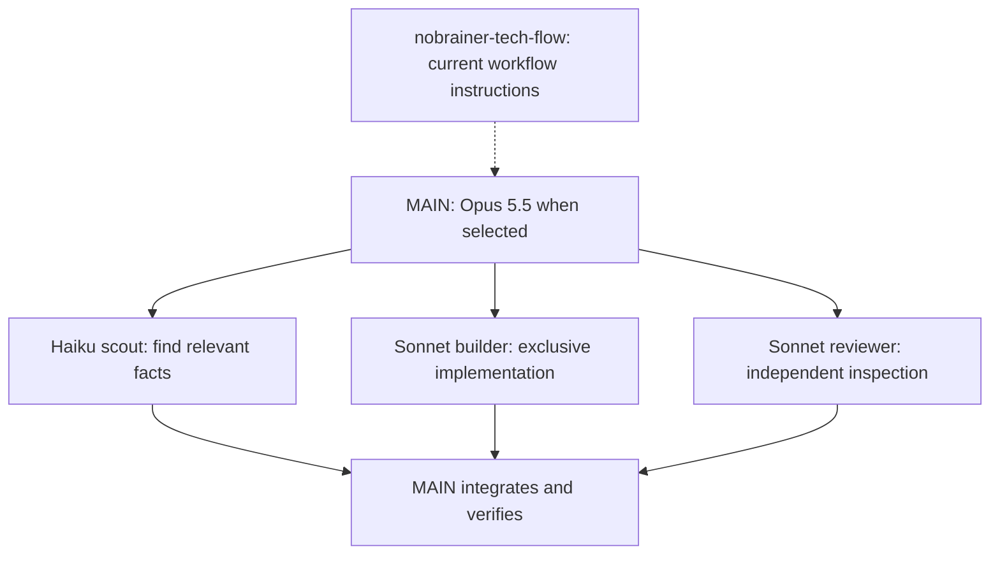

# NoBrainer Claude

**Website:** [nobrainer.tech/claude](https://nobrainer.tech/claude/)

Give Opus the goal. Give focused work to the right agent.

NoBrainer Claude adds a small, inspectable setup to Claude Code: persistent workflow instructions, a Haiku scout, Sonnet implementation and review workers, and a clear connection to [nobrainer-tech-flow](https://github.com/nobrainer-tech/nobrainer-tech-flow). It is designed for **Opus 5.5 as MAIN** when you select it. Your existing model, effort and permissions are preserved by default.

## Start with one prompt

Paste this into your coding assistant:

> Install NoBrainer Claude from https://github.com/nobrainer-tech/nobrainer-claude. Read AGENTS.md and docs/setup.md, inspect my existing Claude Code version and instructions, and use the current published nobrainer-tech-flow installation contract. Preview everything before writing. Run python3 install.py --check, show me the exact owned changes and any blockers, then apply the setup I choose. Preserve my instructions, imports, permissions, model, effort and existing memory. Offer --opus-main only if I want Opus 5.5 as my default, and --enable-auto-memory only if I choose to enable it. Verify /memory, /agents and actual model routing in a fresh Claude session. Never claim a model ran from configuration alone.

Requirements: Python **3.11+**, Git, Claude Code **2.1.280+**, and a discovered installation of nobrainer-tech-flow. Model access depends on your account and provider.

```bash
git clone https://github.com/nobrainer-tech/nobrainer-claude.git
cd nobrainer-claude
python3 install.py --check
python3 install.py --apply
```

If preflight reports nobrainer-tech-flow missing, follow [setup](docs/setup.md) first. Windows can use `py -3.11` instead of `python3`. For a nonstandard config directory use `--claude-dir PATH`; for a plugin-provided entry use `--flow-skill PATH/TO/SKILL.md` after verifying client discovery.

## What changes

| Surface | Result |
|---|---|
| User `CLAUDE.md` | One managed block routes relevant work through the installed nobrainer-tech-flow entry, preserves MAIN choices, and defines delegation and memory boundaries. Existing text and imports remain. |
| `nbc-scout` | Haiku alias, bounded read-only repository discovery. |
| `nbc-builder` | Sonnet alias, one exclusive implementation slice with relevant checks. |
| `nbc-reviewer` | Sonnet alias, independent read-only code inspection; MAIN runs any needed commands. |
| `settings.json` | Unchanged by default. Explicit options can set Opus 5.5 or enable native auto memory. |

This does not install another copy of nobrainer-tech-flow, change authentication, move sessions, weaken permissions, enable experimental agent teams, or set a fictional concurrency limit. Models have different strengths and costs; parallel workers can consume more total tokens. Assign useful work and measure the result instead of treating agent count as a benefit by itself.



## Optional choices

Choose these deliberately and preview with the **same flags** before applying:

```bash
python3 install.py --check --opus-main --enable-auto-memory
python3 install.py --apply --opus-main --enable-auto-memory
```

`--opus-main` writes `model: claude-opus-5-5`. It does not change `effortLevel`. Custom provider/model environment overrides stop this preset rather than silently routing somewhere else. To try Opus in just one session, use the native `claude --model claude-opus-5-5` command instead.

Auto memory is already on by default in current Claude Code. `--enable-auto-memory` is useful if you previously disabled it; it is not a hidden feature unlock. [Memory and routing](docs/compatibility.md) explains the distinction from `CLAUDE.md` and the checks after installation.

## Undo

Apply prints the private backup directory containing preimages of only the files it changed. To restore it:

```bash
python3 install.py --restore PATH_PRINTED_BY_APPLY
```

Restore refuses if you edited an installed file afterward, so later work is not silently overwritten. Keep the backup private: existing settings and instructions may contain sensitive information.

## Verification and boundaries

The tests use isolated temporary homes and exercise preservation, idempotence, conflicts, rollback and restore. [Compatibility](docs/compatibility.md) separates those checks from client discovery and paid model execution. A successful installer does not prove Opus 5.5 access or that every task should be delegated.

This is an independent NoBrainer project, not an Anthropic product or partnership. It complements the canonical [nobrainer-tech-flow](https://github.com/nobrainer-tech/nobrainer-tech-flow) workflow.
